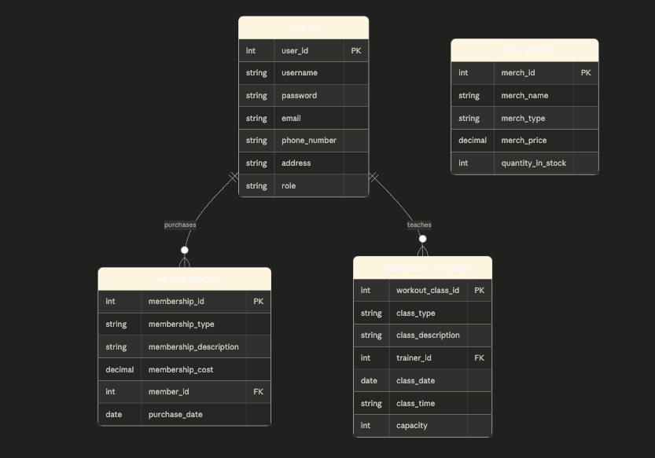
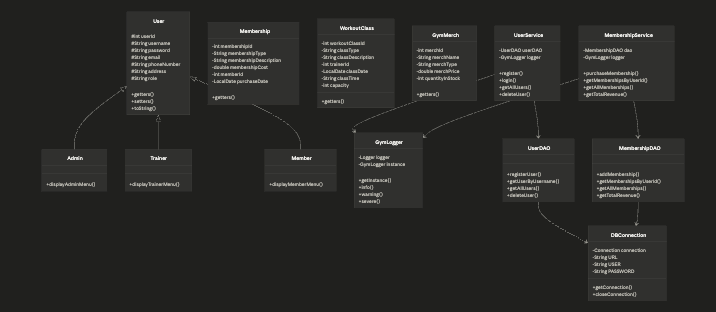

# Gym Management System — Technical Documentation

**Course:** Advanced Java  
**Submission Date:** April 21, 2026  
**Authors:** Brandon Coish and Samantha Stroud

---

## 1. Architecture Overview

The Gym Management System follows a three-layer architecture:
[ Console UI Layer ]
↓
[ Service Layer ]
↓
[ DAO Layer ]
↓
[ PostgreSQL Database ]

**Console UI Layer** — Located in `com.gym.ui`, this layer handles all user interaction via the terminal. It reads input using a Scanner and displays menus based on the logged-in user's role. Key classes include MainMenu, AdminMenu, MemberMenu, TrainerMenu, MembershipMenu, WorkoutClassMenu, and MerchMenu.

**Service Layer** — Located in `com.gym.service`, this layer contains the business logic of the application. It sits between the UI and the DAO layers, handling things like password hashing, input validation, and logging. Key classes include UserService, MembershipService, WorkoutClassService, and MerchService.

**DAO Layer** — Located in `com.gym.dao`, this layer is responsible for all direct database communication. Each DAO class contains SQL queries wrapped in PreparedStatements for safe, injection-proof database operations. Key classes include UserDAO, MembershipDAO, WorkoutClassDAO, and MerchDAO.

**Database** — A PostgreSQL database called `gymdb` stores all persistent data across four tables: users, memberships, workout_classes, and gym_merch.

---

## 2. Class Design

### Inheritance Structure

User (parent)
├── Admin
├── Trainer
└── Member

The `User` class is the base class containing all shared fields and getters/setters. `Admin`, `Trainer`, and `Member` each extend `User` and hardcode their respective role in the constructor. Each subclass also implements its own `displayMenu()` method.

### Key Class Responsibilities

**`User.java`**  
Parent class for all user types. Contains fields: userId, username, password, email, phoneNumber, address, role. Provides getters, setters, and a toString() method.

**`Admin.java`**  
Extends User. Role hardcoded as "ADMIN". Contains displayAdminMenu() which prints admin-specific options.

**`Trainer.java`**  
Extends User. Role hardcoded as "TRAINER". Contains displayTrainerMenu() which prints trainer-specific options.

**`Member.java`**  
Extends User. Role hardcoded as "MEMBER". Contains displayMemberMenu() which prints member-specific options.

**`Membership.java`**  
Model class representing a gym membership. Fields: membershipId, membershipType, membershipDescription, membershipCost, memberId, purchaseDate.

**`WorkoutClass.java`**  
Model class representing a workout class. Fields: workoutClassId, classType, classDescription, trainerId, classDate, classTime, capacity.

**`GymMerch.java`**  
Model class representing a merchandise item. Fields: merchId, merchName, merchType, merchPrice, quantityInStock.

**`DBConnection.java`**  
Utility class using the Singleton pattern to manage a single shared PostgreSQL connection. Located in `com.gym.util`.

**`GymLogger.java`**  
Utility class using the Singleton pattern to manage file-based logging. Writes timestamped log entries to `gym_log.txt`. Located in `com.gym.util`.

**`UserDAO.java`**  
Handles all database operations for users: registerUser(), getUserByUsername(), getAllUsers(), deleteUser().

**`UserService.java`**  
Handles business logic for users: register() with BCrypt hashing, login() with BCrypt verification and role-based routing, getAllUsers(), deleteUser().

**`MembershipDAO.java`**  
Handles all database operations for memberships: addMembership(), getMembershipsByUserId(), getAllMemberships(), getTotalRevenue().

**`MembershipService.java`**  
Handles business logic for memberships: purchaseMembership(), getMembershipsByUserId(), getAllMemberships(), getTotalRevenue().

**`MainMenu.java`**  
Entry point UI class. Displays the welcome screen, handles login and registration input, and routes authenticated users to their role-specific menu.

**`AdminMenu.java`**  
Displays and handles the admin menu: view all users, delete a user, view all memberships, view total revenue.

**`MemberMenu.java`**  
Displays and handles the member menu: browse workout classes, purchase membership, view membership expenses, view merchandise.

**`TrainerMenu.java`**  
Displays and handles the trainer menu: view/add/update/delete workout classes, purchase membership, view merchandise.

**`MembershipMenu.java`**  
Reusable UI class shared between Member and Trainer for purchasing memberships and viewing membership history.

---

## 3. Database Design

### Tables and Relationships

**`users`**  
Stores all registered users regardless of role.

- `user_id` SERIAL PRIMARY KEY
- `username` VARCHAR(50) UNIQUE NOT NULL
- `password` VARCHAR(255) NOT NULL — stores BCrypt hash
- `email` VARCHAR(100) UNIQUE NOT NULL
- `phone_number` VARCHAR(20)
- `address` VARCHAR(255)
- `role` VARCHAR(10) CHECK IN ('ADMIN', 'TRAINER', 'MEMBER')

**`memberships`**  
Stores membership purchases linked to users.

- `membership_id` SERIAL PRIMARY KEY
- `membership_type` VARCHAR(50) NOT NULL
- `membership_description` VARCHAR(255)
- `membership_cost` NUMERIC(10,2) NOT NULL
- `member_id` INT — FOREIGN KEY → users(user_id) ON DELETE CASCADE
- `purchase_date` DATE DEFAULT CURRENT_DATE

**`workout_classes`**  
Stores workout classes created by trainers.

- `workout_class_id` SERIAL PRIMARY KEY
- `class_type` VARCHAR(50) NOT NULL
- `class_description` VARCHAR(255)
- `trainer_id` INT — FOREIGN KEY → users(user_id) ON DELETE CASCADE
- `class_date` DATE NOT NULL
- `class_time` VARCHAR(20) NOT NULL
- `capacity` INT NOT NULL

**`gym_merch`**  
Stores merchandise items available at the gym.

- `merch_id` SERIAL PRIMARY KEY
- `merch_name` VARCHAR(100) NOT NULL
- `merch_type` VARCHAR(50) NOT NULL — e.g. Gear, Drink, Food
- `merch_price` NUMERIC(10,2) NOT NULL
- `quantity_in_stock` INT NOT NULL DEFAULT 0




### Relationships

- `memberships.member_id` → `users.user_id` (many memberships to one user)
- `workout_classes.trainer_id` → `users.user_id` (many classes to one trainer)
- `gym_merch` has no foreign key relationships — it is standalone

---

## 4. Setup Instructions

Follow these steps to clone, configure, and run the project locally.

### Prerequisites

- Java 17 or higher
- Maven 3.x
- PostgreSQL 14 or higher
- Git

### Step 1 — Clone the repository

```bash
git clone https://github.com/BCoishous/Advanced-Java-Final---Gym-Management-System.git
cd Advanced-Java-Final---Gym-Management-System
```

### Step 2 — Create the database

```bash
psql postgres
```

```sql
CREATE DATABASE gymdb;
\q
```

### Step 3 — Run the schema script

```bash
psql gymdb < sql/schema.sql
```

### Step 4 — Configure your database username

Open `src/main/java/com/gym/util/DBConnection.java` and update the USER field to match your local PostgreSQL username:

```java
private static final String USER = "your_username_here";
```

### Step 5 — Build and run

```bash
mvn compile
mvn exec:java -Dexec.mainClass="com.gym.Main"
```

---

## 5. Dependencies

| Dependency        | Version | Purpose                              |
| ----------------- | ------- | ------------------------------------ |
| Java              | 17+     | Programming language                 |
| Maven             | 3.x     | Build tool and dependency management |
| PostgreSQL        | 14+     | Relational database                  |
| postgresql (JDBC) | 42.7.3  | Allows Java to connect to PostgreSQL |
| jbcrypt           | 0.4     | BCrypt password hashing library      |

All Maven dependencies are declared in `pom.xml` and downloaded automatically on first build.

---

## 6. Logging

### What is logged

The GymLogger records the following events:

- Application start and shutdown
- Successful user registrations
- Successful and failed login attempts
- User deletions
- Membership purchases
- Admin actions such as viewing users and revenue

### Log levels used

- `INFO` — normal successful operations
- `WARNING` — failed attempts such as wrong password or duplicate username
- `SEVERE` — critical failures such as a registration that failed at the database level

### Where logs are stored

Logs are written to `gym_log.txt` in the project root directory. This file is excluded from Git via `.gitignore` since it is machine-specific.

### Why logging is used

Logging provides an audit trail of system activity without cluttering the console UI. It helps developers debug issues and allows administrators to track security-relevant events like failed login attempts.
